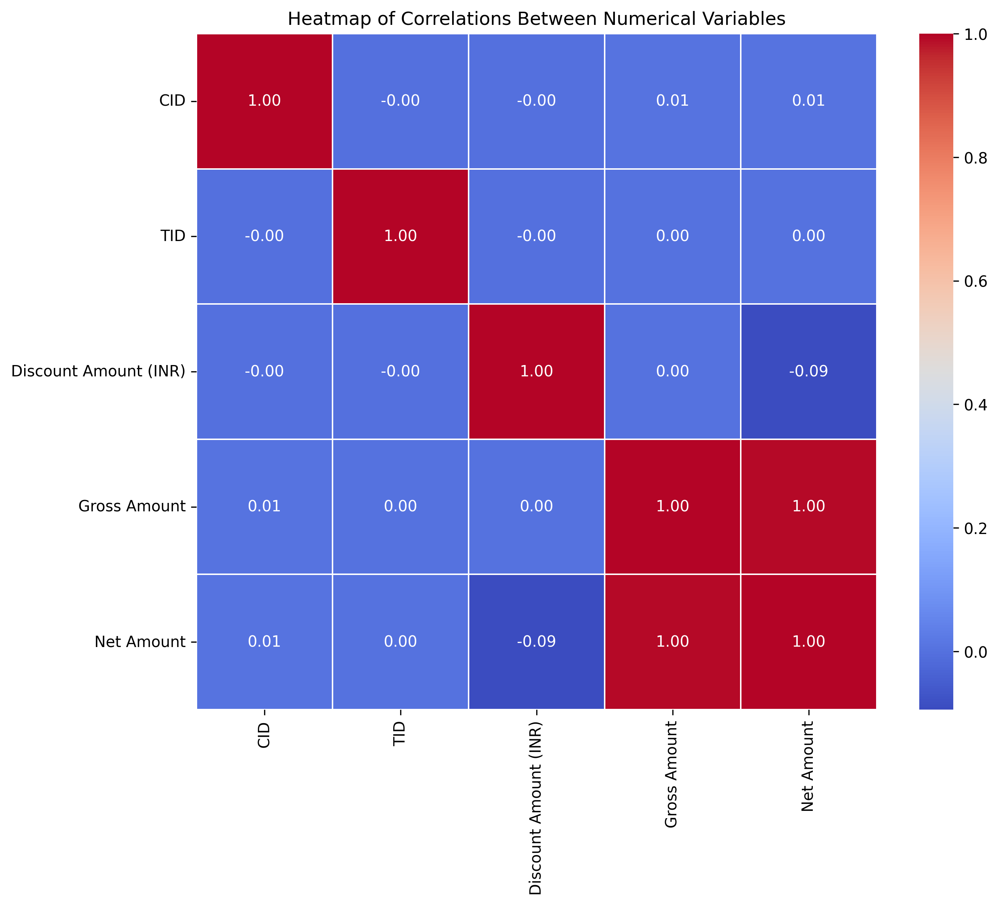

# Customer Transactions Data Analysis

Exploratory data analysis, preprocessing, and validation of a customer transactions dataset using Python. The project cleans raw transaction data, validates its integrity, engineers new features, and analyzes customer behavior across demographics, geography, time, and payment methods.

## Overview

The dataset contains roughly 55,000 transactions from 14 cities across 2019–2024, spanning 9 product categories and 8 payment methods. The full workflow is documented in [`Customer_Transactions_Data_Analysis.ipynb`](Customer_Transactions_Data_Analysis.ipynb) and covers data cleaning, validation (missing values, duplicates, negative amounts, future dates), feature engineering, outlier detection, resolution of inconsistent customer records, and a series of visual analyses leading to business recommendations.

## Dataset

The dataset (`data/project1_df.csv`) contains one row per transaction with the following fields:

| Column | Description |
|---|---|
| `CID` | Customer ID |
| `TID` | Transaction ID |
| `Gender` | Customer gender |
| `Age Group` | Binned age group |
| `Purchase Date` | Transaction timestamp |
| `Product Category` | Category of the purchased product |
| `Discount Availed` | Whether a discount was applied |
| `Discount Name` | Discount code |
| `Discount Amount (INR)` | Discount value in INR |
| `Gross Amount` | Amount before discount |
| `Net Amount` | Amount after discount |
| `Purchase Method` | Payment method used |
| `Location` | City of purchase |

## Analysis Workflow

1. Load and explore the dataset
2. Data preprocessing — datetime conversion, missing values, duplicates
3. Data validation — negative/zero values, future dates
4. Feature engineering — purchase season, standardized data types
5. Outlier detection on gross and net amounts
6. Resolving inconsistent customer records (conflicting locations, age groups, genders)
7. Exploratory analysis — pairplots and correlation heatmaps
8. Analysis by demographics, location, time, and purchase method
9. Customer segmentation
10. Business recommendations

## Selected Results

Correlation between numeric features:



Yearly gross sales by product category:


Gross and net sales by purchase method:


Additional figures are available in the [`images/`](images/) directory.

## Tech Stack

Python, pandas, NumPy, Matplotlib, seaborn, and Jupyter Notebook.

## Getting Started

```bash
git clone https://github.com/aylin-nxt/customer-transactions-data-analysis.git
cd customer-transactions-data-analysis
pip install -r requirements.txt
jupyter notebook Customer_Transactions_Data_Analysis.ipynb
```

## Repository Structure

```
customer-transactions-data-analysis/
├── Customer_Transactions_Data_Analysis.ipynb   # Main analysis notebook
├── data/
│   └── project1_df.csv                         # Transactions dataset
├── images/                                      # Generated visualizations
├── requirements.txt                             # Dependencies
├── LICENSE                                      # MIT License
└── README.md
```

## License

Licensed under the MIT License. See [LICENSE](LICENSE) for details.
